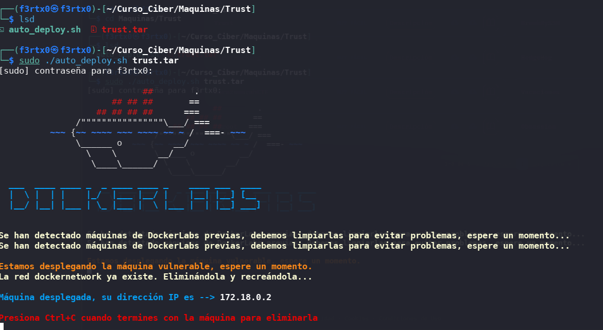
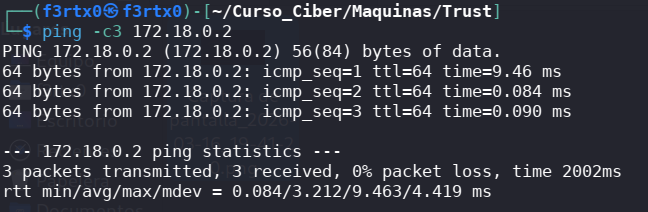
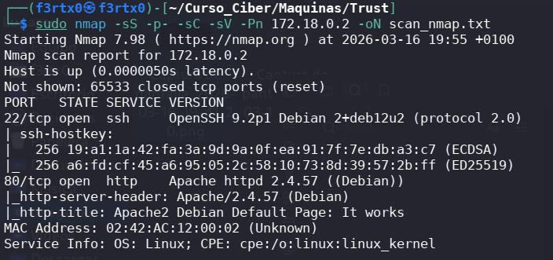
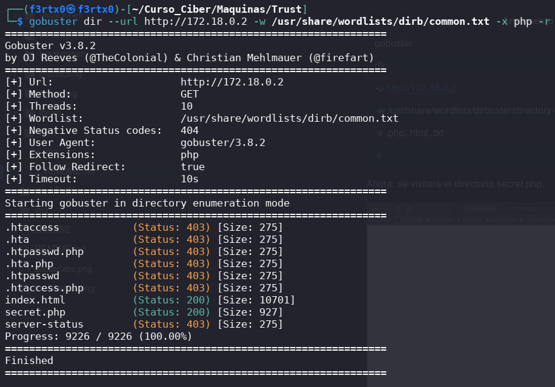
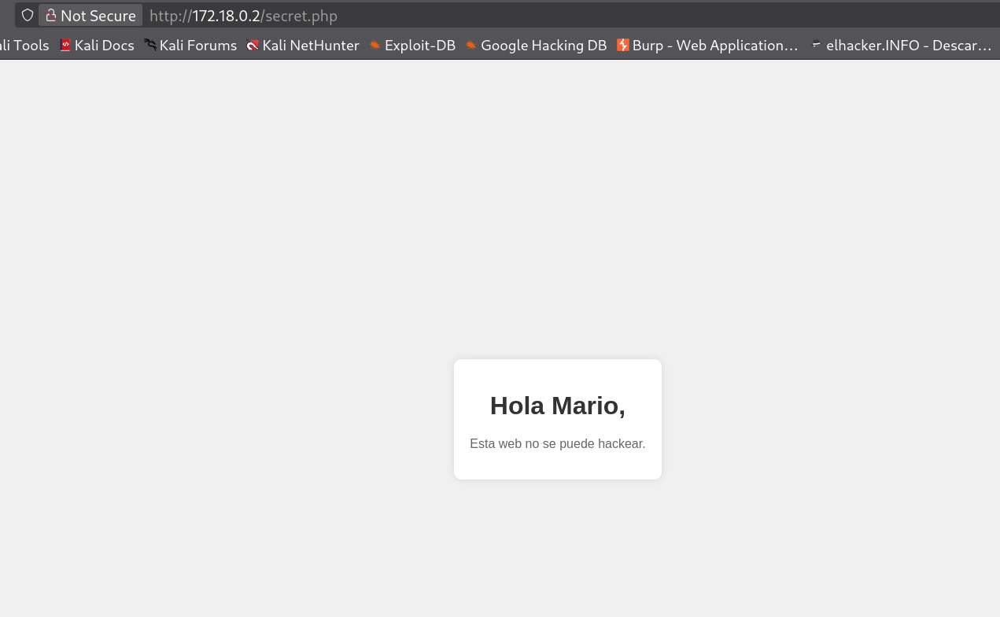
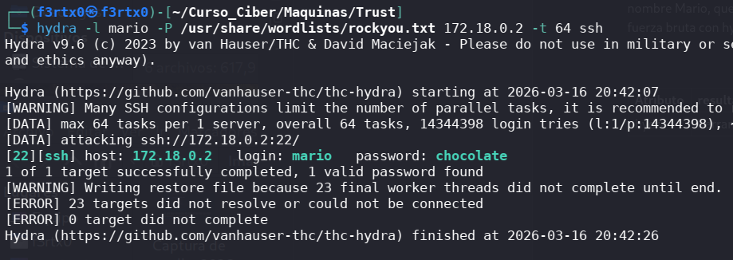
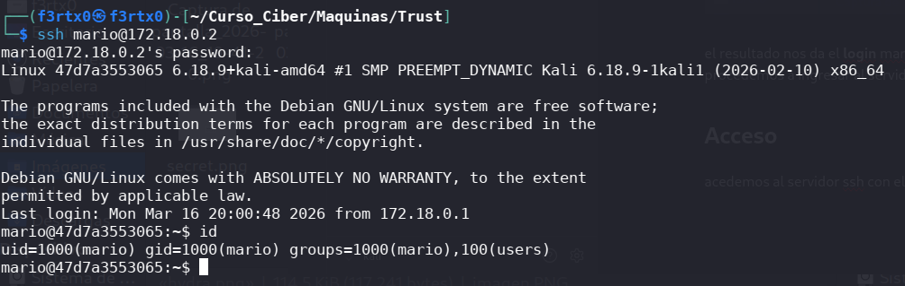
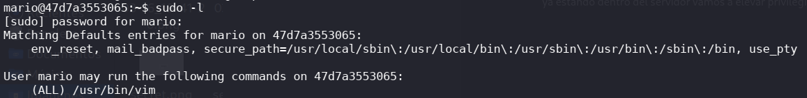
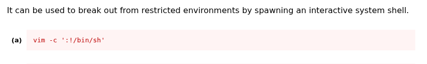
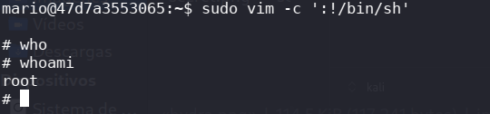

#   🚀 Maquina trust - DockerLabs (Writeup)

## 📊 Descripción 

Este laboratorio forma parte de los [Docker Labs](https://dockerlabs.es/) de práctica de **pentesting**, orientada a la practica de técnicas de reconocimiento, enumeración, explotación y escalada de privilegios en un entorno controlado.

## 🧨Objetivo

Obtener acceso al sistema objetivo y escalar privilegios hasta nivel root.
##  🛠️Herramientas utilizadas  
  
- `nmap` – Escaneo de puertos y servicios  
- `Hydra` – Ataques de fuerza bruta  
- `Netcat` – Conexiones de red y pruebas de shells  
- `Docker` – Entorno controlado para pruebas

# Metodología 

## 1.  🧭 Despliegue

Comenzaremos con el despliegue de la máquina docker. Luego procederemos a descomprimir y ejecutarla.
En la siguiente imagen se evidencia la visual de la máquina desplegada:

# 2.  🌐 Verificación de conexión 

Continuaremos realizando un **ping** que permitió comprobar que la maquina está viva, medir latencia y confirmar conexión en la red.

La imagen anterior nos da como resultado conexión con la red.
# 3. 🔍Reconocimiento

Se realizó  un escaneo inicial  con el comando `sudo nmap -sS -p- -sC -sV -Pn IP`
(sudo es necesario ya que el SYN (-sS ) requiere privilegios). Esto con el fin de identificar servicios expuestos en la máquina objetivo:

Explicación de los atributos de **nmap**:

| Atributo | Resultado                                                                   |
| -------- | --------------------------------------------------------------------------- |
| -sS      | SYN SCAN escaneo silecioso sin completar el handshake                       |
| -p-      | escanea todos los 65535 puertos                                             |
| -sC      | ejecuta los scripts por defecto, esto muchas veces nos da la vulnerabilidad |
| -sV      | para detectar las versiones de servicios, esto nos permite buscar exploits  |
| -oN      | guarda output                                                               |

En la siguiente imagen vemos el resultado que se obtuvo

Resultados relevantes:
- puerto **22** SSH
- puerto **80** http

 **Análisis:**
La presencia de SSH sugiere posible vector de acceso remoto, mientras que HTTP indica una posible superficie de ataque web.
# 4. ℹ️ Enumeración

  Se accedió al servicio web sin encontrar información relevante en la pagina principal. Se procedió a realizar un fuzzing  de directorios con `gobuster dir --url hhtp://IP -w usr/share/wordlists/dirb/common.txt -x php -r` dado que la web no nos mostró información útil.

Explicación de atributos de **gobuster**:

| Atributo | Resultado                                                      |
| -------- | -------------------------------------------------------------- |
| gobuster | es una herramienta de enumeración de directorios y subdominios |
| dir      | modo de busqueda de directorios                                |
| --url    | direccion de la url a enumerar                                 |
| -w       | usar un diccionario para buscar rutas y direcotios             |
| -x       | especificar extenciones de archivos                            |
| -r       | sigue re-direcciones automáticamente                           |

**Hallazgo:**
- /secret.php

**Análisis:**
La existencia de endpoints ocultos indica una mala gestión de recursos y posibles vectores de ataque no protegidos

# 5. 🗝️ Explotación 

Al verificar el directorio /secret.php se identificó información relevante (usuario potencial 'mario'). Se utilizó esta información para realizar un ataque contra el servicio SSH por medio de hydra.

Comando ejecutado: `hydra -l mario -P /usr/share/wordlists/rockyou.txt 172.18.0.2 -t64 ssh`, se explica paso a paso a continuación:

| Atributo | resultado                                                                |
| -------- | ------------------------------------------------------------------------ |
| hydra    | herramienta para realizar ataque de fuerza bruta rapidos y optimatizados |
| -l       | para especificar el usuario                                              |
| -P       | una lista de contraseñas                                                 |
| -t       | numero de hilos utilizados, para su velocidad                            |
| ssh      | el protocolo a utilizar                                                  |

En la imagen anterior vemos el como resultado: **login **`mario` y **password** `chocolate`

**Análisis:**
El uso de credenciales débiles o expuestas facilita el acceso inicial al sistema.
# 6.  🔓 Acceso 

Se accedió  al servidor SSH con el usuario y contraseña obtenido por medio del hydra, a la IP 172.18.0.2:

# 7. ⬆️ Escalada de privilegios

Una vez dentro del sistema se ejecutó el comando **sudo -l** para  ver los binarios con permisos sudo y así obtener acceso.

**Resultado:**
Se detectó que el usuario podía ejecutar 'vim' como super usuario sin contraseña.
Consultamos en [GTFO](https://gtfobins.linuxsec.org/gtfobins/vim/) para encontrar técnicas que permitan abusar de su funcionalidad.
 

Se ejecutó el comando `vim -c ':!/bin/bash'` como resultado:  acceso a root obtenido

**Análisis:**
Configuración incorrecta de privilegios en sudo permitió una escalada directa.

#  👀 Impacto
El sistema queda completamente comprometido:
- Acceso inicial no autorizado
- Escalada a privilegios root
- Control total del sistema

#  📝¿Qué aprendimos?
- La enumeración es la clave incluso sin información visible
- Un endpoint oculto puede ser muy critico
- Las malas configuraciones de sudo son un vector común de escalada
- Es fundamental proteger servicios como SSH contra acceso no autorizados

#  🧠Conclusión

Este laboratorio demuestra cómo una combinación de: mala exposición de servicios, recursos ocultos y configuraciones inseguras puede derivar en el compromiso total de un sistema.
